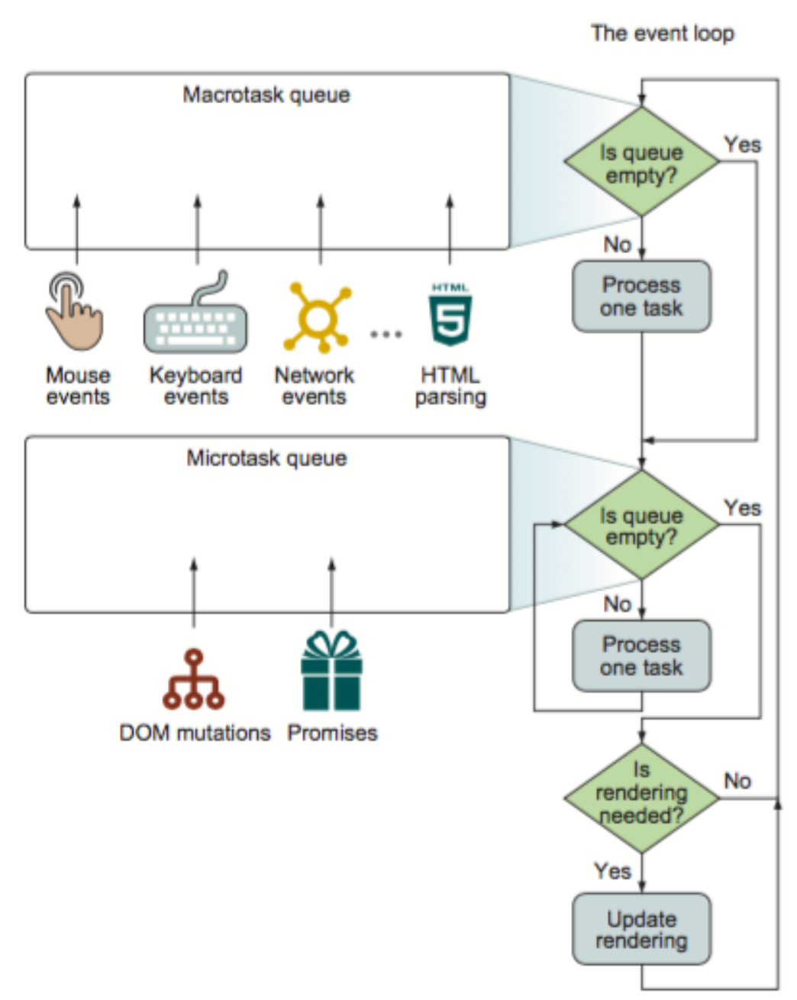

# 浏览器

## 多进程架构

* 以Chrome为例
* 主要进程

```
1. 1个浏览器进程：负责界面显示、用户交互、子进程管理，同时提供存储等功能
2. 1个GPU进程：负责处理GPU相关的任务（3D CSS）
3. 1个网络进程：负责页面的网络资源加载
4. n个渲染进程：转换html、css、javascript为用户可交互的web页面；浏览器每打开一个tab，就会创建一个渲染进程
5. n个插件进程：负责插件的运行
```

## 多线程模式

```
1. 一个渲染进程包含6主要个线程
```

* GUI渲染线程

```
1. 主要负责页面的渲染，解析HTML、CSS，构建DOM树，布局和绘制等
2. 界面需要重绘或者由于某种操作引发回流时，将执行该线程
3. 该线程与JS引擎线程互斥，当执行JS引擎线程时，GUI渲染会被挂起，当任务队列空闲时，主线程才会去执行GUI渲染
```

* JavaScript 引擎线程

```
1. 主要负责处理 JavaScript脚本，执行代码
2. 执行准备好待执行的事件，即定时器计数结束，或者异步请求成功并正确返回时，将依次进入任务队列，等待 JS引擎线程的执行
3. 该线程与GUI渲染线程互斥，当JS引擎线程执行JavaScript脚本时间过长，将导致页面渲染的阻塞
```

* 浏览器事件触发线程

```
1. 主要负责将准备好的事件交给JS引擎线程执行，比如setTimeout定时器计数结束，ajax等异步请求成功并触发回调函数，或者用户触发点击事件时，该线程会将整装待发的事件依次加入到任务队列的队尾，等待JS引擎线程的执行
```

* 定时器触发线程

```
1. 负责执行异步定时器一类的函数的线程，如：setTimeout，setInterval
2. 主线程依次执行代码时，遇到定时器，会将定时器交给该线程处理，当计数完毕后，事件触发线程会将计数完毕后的事件加入到任务队列的尾部，等待JS引擎线程执行
```

* 异步http请求线程

```
1. 负责执行异步请求一类的函数的线程，如：Promise，axios，ajax等
2. 主线程依次执行代码时，遇到异步请求，会将函数交给该线程处理，当监听到状态码变更，如果有回调函数，事件触发线程会将回调函数加入到任务队列的尾部，等待JS引擎线程执行
```

* Event loop轮询处理线程

```
1. Wikipedia定义：EventLoop是一个程序结构，用于等待和发送消息和事件。（aprogramming construct that waits for and dispatches events or messages in aprogram.）
2. 负责主线程与其他进程（主要是各种I/O操作）的通信
```

## 其它

* 内核：包括渲染引擎和JavaScript引擎，由于JavaScript引擎越来越独立，内核就倾向于只指渲染引擎

```
1. 渲染引擎：Chrome使用Webkit引擎
2. JavaScript引擎：Chrome使用V8引擎
```

* V8引擎：用来执行JS代码，浏览器和Node是JS执行环境，其提供一些JS可以调用的API即`JS bindings`

```
1. 堆-内存分配发生的地方
2. 栈-函数调用时会形一个个栈帧（frame）=>执行栈

*执行栈
每一个函数执行的时候，都会生成新的execution context（执行上下文），执行上下文会包含一些当前函数的参数、局部变量之类的信息，它会被推入栈中， running execution context（正在执行的上下文）始终处于栈的顶部。当函数执行完后，它的执行上下文会从栈弹出
```

* Web API：浏览器提供的一系列用于操作浏览器和网页元素的方法、接口，供JavaScript调用

```
1. BOM：window.setTimeout
2. DOM: document.getElementById
```

# JavaScript

* 单线程：在某个特定的时刻只有特定的代码能够被执行，并阻塞其它的代码

```
1. 避免多线程执行不同任务会发生冲突的情况: 线程A删除当前的DOM节点，线程B要操作当前的DOM节点
2. 若JavaScript主线程被阻塞，而其又和GUI渲染线程互斥，即JavaScript主线程未执行完，则GUI渲染线程一直处于等待中，就会造成浏览器假死
```

* 异步 | 非阻塞：如发起一个ajax请求，在拿到响应前，主程序并没有停止

```
1. 由事件循环实现，而事件循环是由运行时环境实现的, 具体来说有浏览器、Node等
```

# EventLoop

## 原理概览

* 基本原理


* 基本说明

```
1. JavaScript引擎：主线程，同步执行JavaScript代码
2. WebAPIs：处理诸如DOM事件、http请求、定时器等异步事件
3. Event Loop：并发机制
4. Callback Queue：任务队列，存放异步任务的回调函数
```

* 基本流程

```
1. 函数入执行栈，当栈中执行到异步任务的时候，就将其丢给WebAPIs，接着执行同步任务，直到栈为空;
2. 在此期间WebAPIs完成异步事件，并把回调函数放入任务队列中等待;
3. 当执行栈为空时，Event Loop把任务队列中的一个任务放入栈中，回到第1步
```

## 任务队列

* 队列类型：macro（宏任务）队列和 micro（微任务）队列

```
1. 从规范理解，浏览器至少有一个事件循环，一个事件循环至少有一个宏任务队列
2. 宏任务队列可以有多个，微任务队列只有一个
```

* 任务类型：宏任务（macrotask）和微任务（microtask）

```
1. 宏任务：script（全局任务）、setTimeout、setInterval、setImmediate（node.js 独有）、I/O（磁盘读写或网络通信）、UI rendering（UI交互事件）
2. 微任务（microtask）：process.nextTick（node.js 独有）、Promise.then、Object.observer（已废弃）、MutationObserver（html5新特性）
```

* 基本原理



* 循环过程

```javascript
1. 检查macrotask队列是否为空，非空则到2，为空则到3
2. 执行macrotask中的一个任务
3. 继续检查microtask队列是否为空，若有则到4，否则到5
4. 取出microtask中的任务执行，执行完成返回到步骤3
5. 检查并在必要时执行视图更新

*特别说明
1. 执行宏任务过程产生宏任务，则将新宏任务添加至宏任务队列末尾，待后面的事件循环取出执行
2. 执行宏任务过程产生微任务，则将新微任务添加至微任务队列末尾，待当前宏任务执行完毕后按序出队执行
3. 执行微任务过程产生宏任务，则将新宏任务添加至宏任务队列末尾，待后面的事件循环取出执行
4. 执行微任务过程产生微任务，则将新微任务添加至微任务队列末尾，待当前微任务执行完毕后按序出队执行：
Promise.resolve().then(() => {
    console.log('promise1');
    Promise.resolve().then(() => { // 只有执行到了这一步，console.log('promise2')才会被添加到微任务队列
        console.log('promise3');
    });
}).then(() => {
    // 根据规范2.2.2.1，then回调的执行必须在上一个promise的状态为fulfilled
    // 当前then，其实是被缓存在上一个promise内部的回调队列里，等上一个promise状态改变再放入微任务队列
    console.log('promise4');
});

Promise.resolve().then(() => {
    console.log('promise2');
    Promise.resolve().then(() => {
        console.log('promise5');
    })
}).then(() => {
    console.log('promise6');
});
// 输出顺序：promise1、promise2、promise3、promise4、promise5、promise6
```

## 实际应用

* 耗时长任务拆分执行

```javascript
// 一个耗时长的计算任务
let i = 0;
function count() {
    for (let j = 0; j < 1e9; j++) {
        i++;
    }
    console.log('count end');
}
count();
console.log('go on');

// 把一个连续的计算任务分切成了1000个小任务，并且不会阻塞主线程的工作
let i = 0;
function count() {
    setTimeout(() => {
        count();
    }, 0);
    for (let j = 0; j < 1e6; j++) {
        i++;
    }
    if (i === 1e9) {
        console.log('count end');
    }
}
count();
console.log('go on');
```

### vue.nextTick

* 用法：将回调延迟到下次 DOM 更新循环之后执行。在修改数据之后立即使用它，然后等待 DOM 更新

```javascript
new Vue({
  // ...
  methods: {
    // ...
    example: function () {
      // 修改数据
      this.message = 'changed'
      // DOM 还没有更新
      this.$nextTick(function () {
        // DOM 现在更新了
        this.doSomethingElse()
      })
    }
  }
})
```

* 迭代：微任务 or 宏任务

```
1. v2.0.0 - v2.4.4 微任务：MutationObserver、Promise
2. v2.5.0 - v2.5.1 宏任务：setImmediate、MessageChannel
3. v2.5.2 - v2.5.20 微宏并行：默认情况都是走微任务，只有绑定的事件函数执行时走宏任务
4. v2.6.0 - v2.6.12 微任务：对事件执行做了一些改动，阻止早期发现某些情况下由于微任务优先级太高导致的函数执行
```

