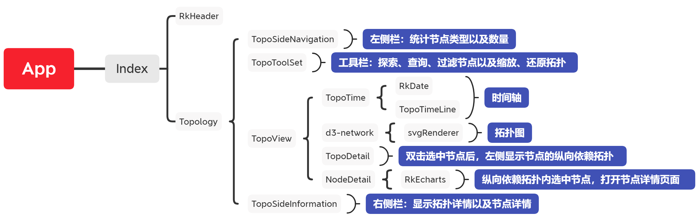
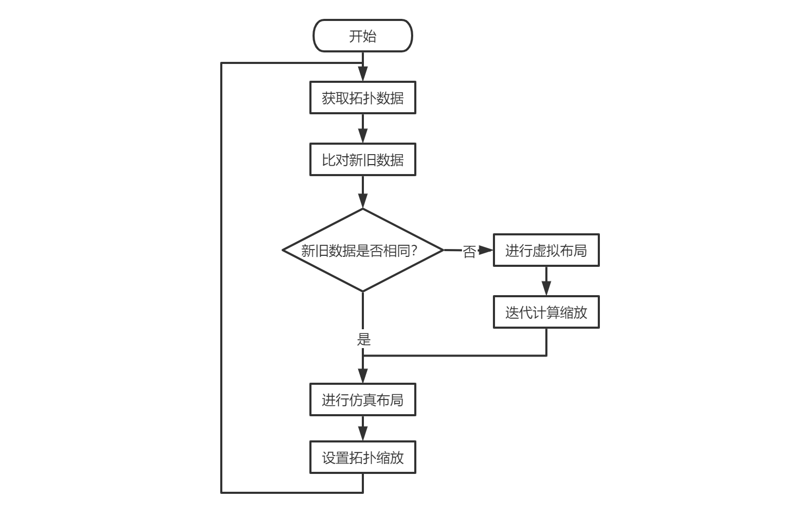

## 需求背景

* 对接全息排查Console模块，提供拓扑图式运维界面

## 部署方法

1. 进入工程根目录：.../console-ui，执行打包命令：npm run build
2. 获取打包产物：.../console-ui/dist，交由Console开发人员打成可部署的jar包

## 运行环境

* Google Chrome 87及以上，64 位

## 业务流程

### 基本流程

1. 通过拓扑图，实时查看整个系统的基本情况：节点类型、节点数量、节点状态、节点关系等等
2. 当某个应用节点发生故障时，则该节点出现告警事件图标，然后在拓扑图内选中该节点
3. 选中故障节点后，查看该节点的详情信息：id、名称、类型、创建时间、更新时间等等
4. 选中故障节点后，查看该节点的事件列表：事件数量、等级、详情等等，进行初步排查
5. 选中故障节点后，查看该节点的上下游节点，排查这些节点是否同样有故障，有则依次回到步骤2
6. 选中故障节点后，查看该节点的依赖节点，排查这些节点是否同样有故障，有则依次回到步骤2
7. 通过步骤4、5、6，排查出故障根因，解决问题后，回到步骤1

### 交互设计

#### 进入拓扑页面

1. 页面分头部、左侧栏、中间拓扑图、右侧栏，其中拓扑图上方提供时间轴、工具栏
2. 头部显示项目logo，提供导航、刷新、轮询功能
3. 左侧栏分层：Applications、MiddleWares、Processes、Workloads、Pods、Nodes
4. 左侧栏每层统计节点信息：节点总数、异常数量
5. 拓扑图默认展示全部节点、全部边，大小自适应视口
6. 拓扑图内点通过图标区分类型，边通过虚实线区分类型
7. 拓扑图事件节点有标记，并且区分等级：严重、警告
8. 右侧栏显示拓扑图摘要信息、选中节点的详情信息
9. 时间轴提供选择时间范围、切换区间模式、时间范围滑块、播放功能
10. 工具栏提供探索拓扑、搜索节点、缩放控制、过滤节点功能

#### 刷新拓扑数据

1. 头部右侧可以手动刷新当前拓扑数据，并支持轮询自动刷新
2. 时间轴可选时间范围为 (30s, 24h] ，默认选择近10分钟的拓扑数据
3. 时间轴选择查看全部区间，则可查看所选时间范围整段的拓扑数据
4. 时间轴选择查看单位区间，则以1小时为单位刻度，可通过拖拽滑块、点击时间轴或点击播放按钮，查看所选时间范围内不同小时段的拓扑数据

#### 过滤拓扑数据

1. 工具栏提供过滤器功能，可以只查看特定类型的节点、特定状态的节点、特定关联关系的节点（上下游）
2. 左侧栏点击每个分层，可以只查看该分层对应类型的节点

#### 拓扑基本操作

1. 拓扑图支持鼠标单击拖拽、滚轮缩放
2. 拓扑图内hover点时，点高亮，至少显示点名称，并高亮其第一跳点、边
3. 拓扑图内hover边时，边高亮，至少显示链路类型，并高亮其两端点，其中非静态边还需要显示调用频率以及平均响应时间
4. 拓扑图内点支持鼠标单击拖拽
5. 工具栏提供缩放拓扑、还原拓扑功能按钮

#### 查看目标节点

1. 拓扑图内单击节点，右侧栏显示该节点的详情信息，其中EventCount字段后面提供查看节点事件功能按钮
2. 在1中的节点详情信息里点击查看节点事件按钮，可以查看该节点的事件列表以及每条事件的详情
3. 拓扑图内双击节点，则选中节点居中放大（自适应视口）展示，同时左侧打开选中节点的纵向依赖拓扑，对应用节点而言，此时中间默认显示其上下游点、边组成的拓扑
4. 左侧纵向拓扑内事件节点有标记，并且区分等级：严重、警告
5. 左侧纵向拓扑内hover点时，至少显示点名称
6. 左侧纵向拓扑内hover边时，边高亮，至少显示链路类型，并高亮其两端点，其中非静态边还需要显示调用频率以及平均响应时间
7. 左侧纵向拓扑内单击节点，展示查看节点详情功能按钮，点击它可以打开节点详情面板，节点详情面板包含该节点第一跳点、边组成的拓扑
8. 左侧纵向拓扑内双击节点，则效果同3
9. 工具栏输入节点id进行搜索，若匹配到结果，则效果同3
10. 工具栏内点击探索拓扑，可以查看目标节点（主要是针对应用节点）的上下游调用拓扑，全量替换当前拓扑图
11. 拓扑图内鼠标右击拓扑，可以查看目标节点（主要是针对应用节点）的上下游调用拓扑，全量替换当前拓扑图

## 技术选型

* 工程框架：skywalking-rocketbot-ui-8.1.0
* 绘制拓扑：d3js 、echarts
* UI组件库：element-ui

## 模块设计

### 组件结构



### 布局流程



## 工程目录

```javascript
console-ui // 根目录
├─ ...
├─ public
│  ├─ ...
│  └─ index.html // 页面文档
├─ src
│  ├─ ...
│  ├─ App.vue // 根组件
│  ├─ assets // 基础资源目录
│  ├─ components // 基础组件目录
│  ├─ constants // 基础变量目录
│  │  └─ topo.ts
│  ├─ main.ts  // 入口文件
│  ├─ router.ts // 路由文件
│  ├─ store // 状态管理目录
│  │  ├─ index.ts
│  │  ├─ modules
│  │  │  ├─ global
│  │  │  │  └─ index.ts
│  │  │  └─ topology
│  │  │     └─ index.ts
│  │  └─ mutation-types.ts
│  ├─ utils  // 基础工具目录
│  └─ views // 页面管理目录
│     ├─ components // 业务组件目录
│     │  └─ topology
│     │     ├─ assets
│     │     ├─ d3-network // 核心绘制拓扑组件
│     │     │  ├─ components
│     │     │  │  └─ svgRenderer.vue
│     │     │  ├─ lib
│     │     │  ├─ utils.js
│     │     │  └─ vue-d3-network.vue
│     │     ├─ topo-detail.vue
│     │     ├─ topo-side-information.vue
│     │     ├─ topo-side-navigation.vue
│     │     ├─ topo-time-line.vue
│     │     ├─ topo-time.vue
│     │     ├─ topo-tool-set.vue
│     │     ├─ topo-view.vue
│     │     └─ utils
│     └─ containers  // 容器组件目录
│        ├─ help-center.vue // 帮助中心组件
│        ├─ index.vue
│        └─ topology.vue // 拓扑组件
└─ ...
```

## 接口说明

1. 获取场景配置：/v1/scene-config

2. 获取节点事件：/v1/events

3. 获取节点依赖：/v1/underlying-resources

4. 获取节点上下游调用：/v1/applications

5. 获取拓扑数据：/v1/endpoints


