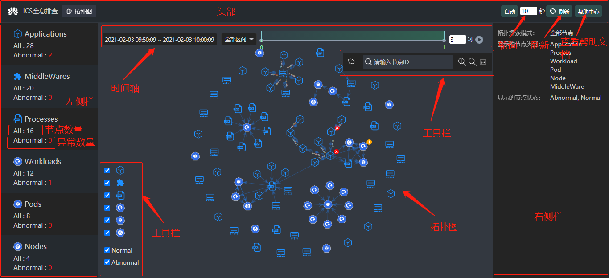
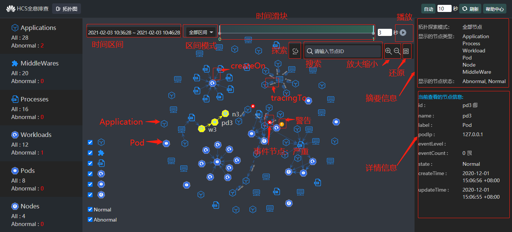
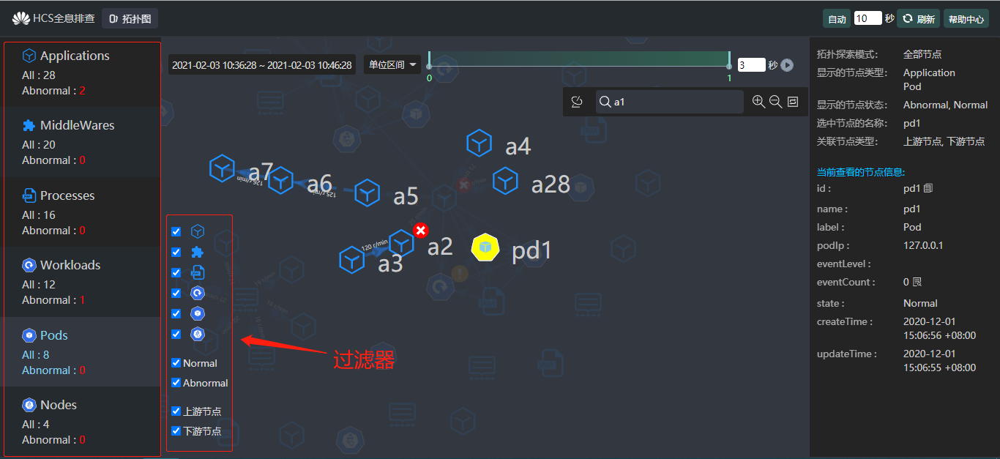
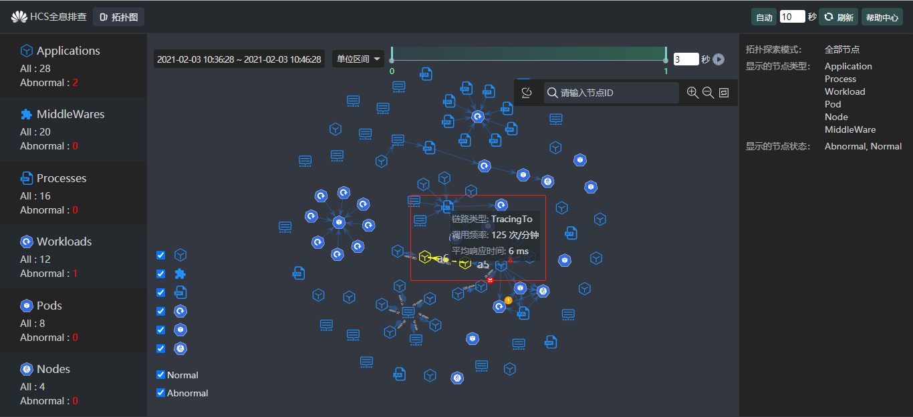
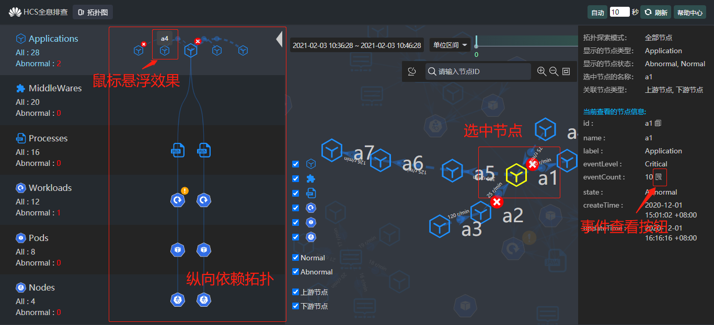
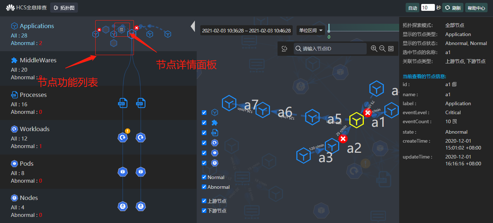
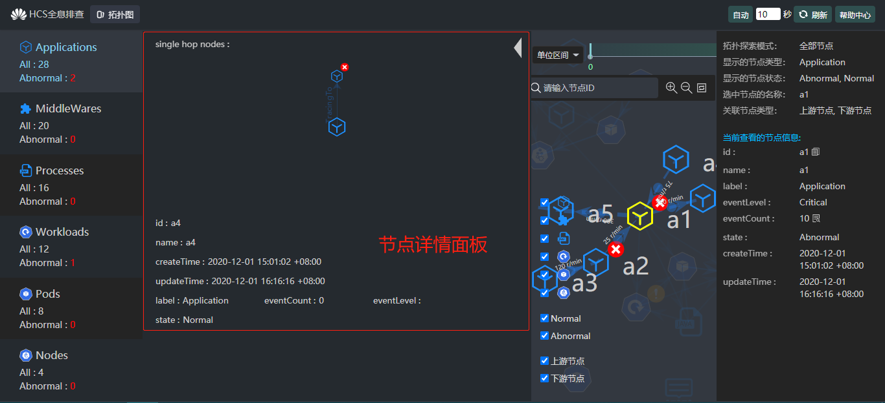
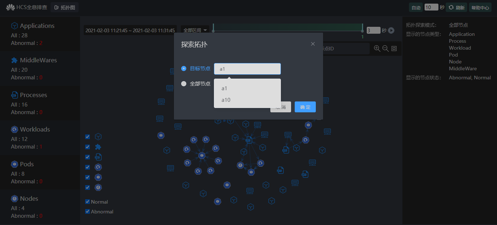
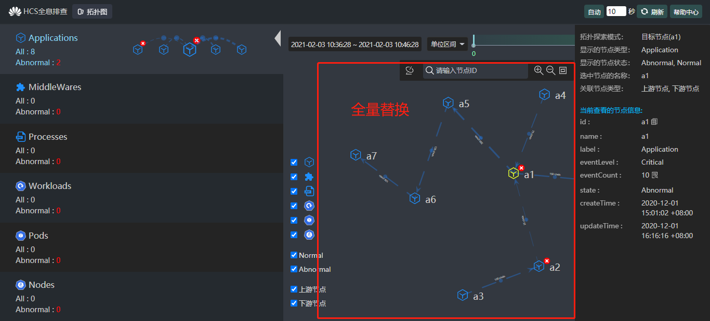
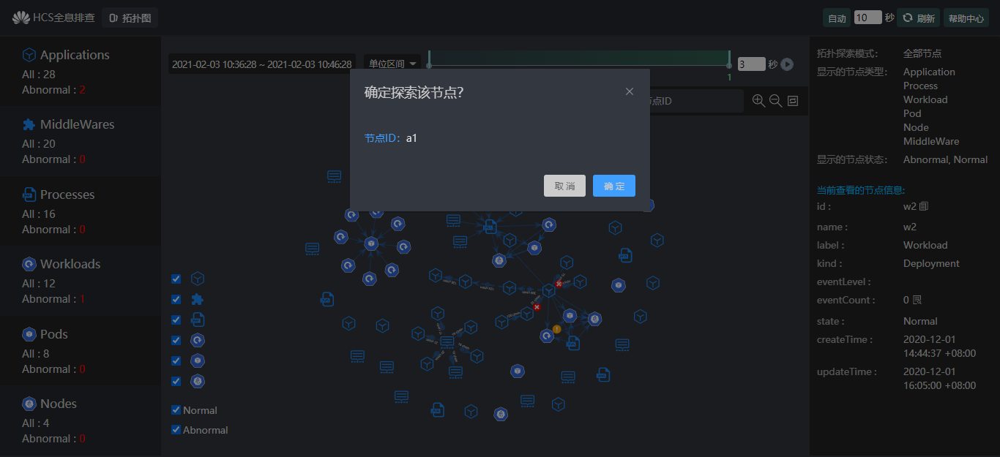

# 操作手册

## 基本介绍

- 对接全息排查Console模块，提供拓扑图式运维界面
- 应用链路、节点、资源从属关系等故障点展示和排查

## 页面概览

1. 页面分头部、左侧栏、中间拓扑图、右侧栏，其中拓扑图上方提供时间轴、工具栏
2. 头部显示项目logo，提供导航、刷新、轮询、查看帮助文档功能
3. 左侧栏分层：Application、MiddleWare、Process、Workload、Pod、Node
4. 左侧栏每层统计节点信息：节点总数、异常数量
5. 拓扑图默认展示全部节点、全部边，大小自适应视口
   
6. 拓扑图内点通过图标区分类型，边通过虚实线区分类型
7. 拓扑图事件节点有标记，并且区分等级：严重、警告
8. 右侧栏显示拓扑图摘要信息、选中节点的详情信息
9. 时间轴提供选择时间范围、切换区间模式、时间范围滑块、播放功能
10. 工具栏提供探索拓扑、搜索节点、缩放控制、过滤节点功能
    

## 业务流程

### 刷新拓扑数据

1. 头部右侧可以手动刷新当前拓扑数据，并支持轮询自动刷新
2. 时间轴可选时间范围为 (30s, 24h] ，默认选择近10分钟的拓扑数据
3. 时间轴选择查看全部区间，则可查看所选时间范围整段的拓扑数据
4. 时间轴选择查看单位区间，则以1小时为单位刻度，可通过拖拽滑块、点击时间轴或点击播放按钮，查看所选时间范围内不同小时段的拓扑数据

### 过滤拓扑数据

1. 工具栏提供过滤器功能，可以只查看特定类型的节点、特定状态的节点、特定关联关系的节点（上下游）
2. 左侧栏点击每个分层，可以只查看该分层对应类型的节点
   

### 拓扑基本操作

1. 拓扑图支持鼠标单击拖拽、滚轮缩放
2. 拓扑图内hover点时，点高亮，至少显示点名称，并高亮其第一跳点、边
3. 拓扑图内hover边时，边高亮，至少显示链路类型，并高亮其两端点，其中非静态边还需要显示调用频率以及平均响应时间
   
4. 拓扑图内点支持鼠标单击拖拽
5. 工具栏提供缩放拓扑、还原拓扑功能按钮

### 查看目标节点

1. 拓扑图内单击节点，右侧栏显示该节点的详情信息，其中EventCount字段后面提供查看节点事件功能按钮
2. 在1中的节点详情信息里点击查看节点事件按钮，可以查看该节点的事件列表以及每条事件的详情
3. 拓扑图内双击节点，则选中节点居中放大（自适应视口）展示，同时左侧打开选中节点的纵向依赖拓扑，对应用节点而言，此时中间默认显示其上下游点、边组成的拓扑
   
4. 左侧纵向拓扑内事件节点有标记，并且区分等级：严重、警告
5. 左侧纵向拓扑内hover点时，至少显示点名称
6. 左侧纵向拓扑内hover边时，边高亮，至少显示链路类型，并高亮其两端点，其中非静态边还需要显示调用频率以及平均响应时间
7. 左侧纵向拓扑内单击节点，展示查看节点详情功能按钮，点击它可以打开节点详情面板，节点详情面板包含该节点第一跳点、边组成的拓扑
   
   
8. 左侧纵向拓扑内双击节点，则效果同3
9. 工具栏输入节点id进行搜索，若匹配到结果，则效果同3
10. 工具栏内点击探索拓扑，可以查看目标节点（主要是针对应用节点）的上下游调用拓扑，全量替换当前拓扑图
    
    
11. 拓扑图内鼠标右击拓扑，可以查看目标节点（主要是针对应用节点）的上下游调用拓扑，全量替换当前拓扑图
    